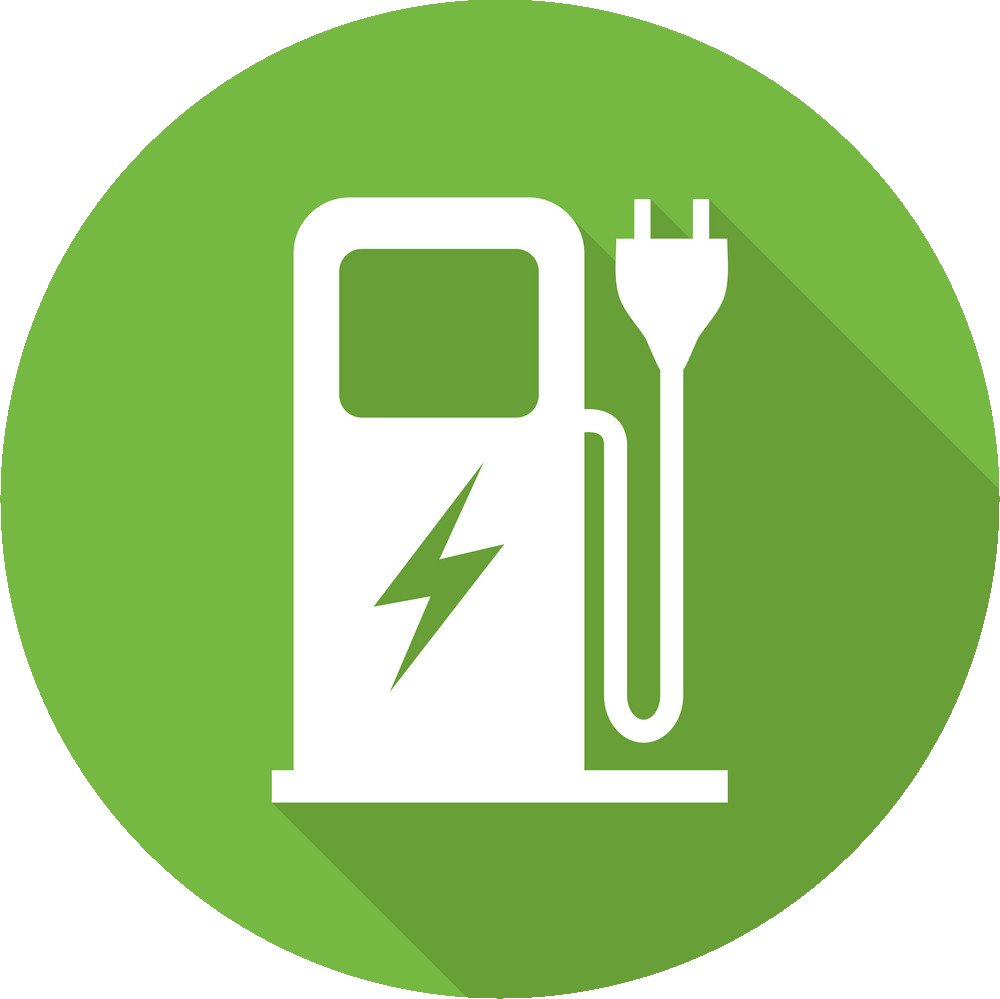

<!-- Improved compatibility of back to top link: See: https://github.com/othneildrew/Best-README-Template/pull/73 -->
<a name="readme-top"></a>
<!--
*** Thanks for checking out the Best-README-Template. If you have a suggestion
*** that would make this better, please fork the repo and create a pull request
*** or simply open an issue with the tag "enhancement".
*** Don't forget to give the project a star!
*** Thanks again! Now go create something AMAZING! :D
-->


<!-- PROJECT SHIELDS -->
<!--
*** I'm using markdown "reference style" links for readability.
*** Reference links are enclosed in brackets [ ] instead of parentheses ( ).
*** See the bottom of this document for the declaration of the reference variables
*** for contributors-url, forks-url, etc. This is an optional, concise syntax you may use.
*** https://www.markdownguide.org/basic-syntax/#reference-style-links
-->

[![LinkedIn][linkedin-shield]][linkedin-url]


<!-- PROJECT LOGO -->
<br />
<div align="center">
  <a href="https://github.com/jpbarcenas/charge-my-ev-api">
    
  </a>

<h3 align="center">Charge My EV</h3>

  <p align="center">
    REST API for managing data about EV charging stations.
    <br />
    <a href="https://github.com/jpbarcenas/charge-my-ev-api"><strong>Explore the docs »</strong></a>
    <br />
    <br />
    <a href="https://github.com/jpbarcenas/charge-my-ev-api">View Demo</a>
    ·
    <a href="https://github.com/jpbarcenas/charge-my-ev-api/issues">Report Bug</a>
    ·
    <a href="https://github.com/jpbarcenas/charge-my-ev-api/issues">Request Feature</a>
  </p>
</div>


<!-- TABLE OF CONTENTS -->
<details>
  <summary>Table of Contents</summary>
  <ol>
    <li>
      <a href="#about-the-project">About The Project</a>
      <ul>
        <li><a href="#project-requirements">Project Requirements</a></li>
        <ul>
            <li><a href="#backend">Backend</a></li>
            <li><a href="#bonus">Bonus</a></li>
        </ul>
        <li><a href="#built-with">Built With</a></li>
      </ul>
    </li>
    <li>
      <a href="#getting-started">Getting Started</a>
      <ul>
        <li><a href="#prerequisites">Prerequisites</a></li>
        <li><a href="#installation">Installation</a></li>
      </ul>
    </li>
    <li><a href="#usage">Usage</a></li>
    <li><a href="#roadmap">Roadmap</a></li>
    <li><a href="#contributing">Contributing</a></li>
    <li><a href="#license">License</a></li>
    <li><a href="#contact">Contact</a></li>
    <li><a href="#acknowledgments">Acknowledgments</a></li>
  </ol>
</details>


<!-- ABOUT THE PROJECT -->
## About The Project

[![Product Name Screen Shot][product-screenshot]](https://example.com)

<p>This sample project is about the design and implement a REST API for managing data about EV charging stations. It is essential to understand the operation of the charging station and the data required for its management. </p>
<p>
The API allow for the creation, retrieval, update, and deletion of charging station data, as well as provide real-time information about the status and availability of charging stations to EV drivers and charging network operators. By providing this data, the API can help EV drivers locate available charging stations, plan charging routes, and manage their charging sessions efficiently, while also helping charging station operators manage their charging station network and optimize their operations.</p>


<p align="right">(<a href="#readme-top">back to top</a>)</p>

## Project Requirements
#### Backend:
* Design and implement a REST API.
* Use Java 8+ and the Spring Boot framework
* Persist data to a MySQL database using Hibernate/JPA
* Implement caching where applicable (e.g. for availability status check)
* Achieve at least 85% test coverage using JUnit and Mockito
* Follow best practices for REST API design and scalability
* Implement TDD/BDD during development
* Use atomic commits, follow Git best practices and publish your code to a public GitHub repository
* Provide instructions for running/testing the API locally
* Build a Docker image for the API and provide the image tag

#### Bonus:
* Deploy the API to a cloud platform and provide a live URL 
* Implement monitoring/alerting for the API 
* Implement authentication/authorization
* Implement an architecture based in microservices using Spring.
* Create a frontend application to consume the backend API, ideally using Angular.
	* Build components to:
		* List all charging stations 
		* View details for a single charging station
		* Check availability status of a charging station
	* Follow Angular best practices for:
		* Project structure 
		* Component reusability
		* Dependency management 
		* Routing
		* Testing
	* Containerize the Angular application in a separate Docker image


### Built With

* [![Java][Java]][Java-url]
* [![SpringBoot][SpringBoot]][Angular-url]
* [![MySQL][MySQL]][MySQL-url]
* [![JWT][JWT]][JWT-url]
* [![Angular][Angular.io]][Angular-url]

<p align="right">(<a href="#readme-top">back to top</a>)</p>


<!-- GETTING STARTED -->
## Getting Started

This is an example of how you may give instructions on setting up your project locally.
To get a local copy up and running follow these simple example steps.

### Prerequisites

In order to use and test the code locally, you should download and install the following tools.
* [Java 17+](https://www.java.com/en/download/)
* [IntelliJ IDEA Community](https://www.jetbrains.com/idea/) or [VS Code](https://code.visualstudio.com/)
* [MySQL Community Server](https://dev.mysql.com/downloads/mysql/) and [MySQL Workbench](https://dev.mysql.com/downloads/mysql/)
* [Postman](https://www.postman.com/downloads/)

### Installation

1. Get a free API Key at [https://example.com](https://example.com)
2. Clone the repo
   ```sh
   git clone https://github.com/jpbarcenas/charge-my-ev-api.git
   ```
3. Install NPM packages
   ```sh
   npm install
   ```
4. Enter your API in `config.js`
   ```js
   const API_KEY = 'ENTER YOUR API';
   ```

<p align="right">(<a href="#readme-top">back to top</a>)</p>


<!-- USAGE EXAMPLES -->
## Usage

Use this space to show useful examples of how a project can be used. Additional screenshots, code examples and demos work well in this space. You may also link to more resources.

_For more examples, please refer to the [Documentation](https://github.com/jpbarcenas/charge-my-ev-api)_

<p align="right">(<a href="#readme-top">back to top</a>)</p>


<!-- ROADMAP -->
## Roadmap

- [ WIP ] Manage EV Charging Station
    - [ DONE ] Create Stations
    - [ DONE ] Get List of Stations
    - [ DONE ] Get a Station By Id
    - [ DONE ] Update Stations
    - [ DONE ] Delete Stations
    - [ WIP ] Get Station Status (AVAILABLE, IN USE)
- [ WIP ] Manage Stations Charging Points
    - [ DONE ] Create Points
    - [ DONE ] Get List of Points for a Station
    - [ DONE ] Get a Point Details for a Station
    - [ DONE ] Update Points
    - [ DONE ] Delete Points
    - [ WIP ] Get Points Status (AVAILABLE, IN USE)

See the [open issues](https://github.com/jpbarcenas/charge-my-ev-api/issues) for a full list of proposed features (and known issues).

<p align="right">(<a href="#readme-top">back to top</a>)</p>


<!-- LICENSE -->
## License

Distributed under the MIT License. See `LICENSE.txt` for more information.

<p align="right">(<a href="#readme-top">back to top</a>)</p>


<!-- CONTACT -->
## Contact

Jorge Pérez - [@jpbarcenas](https://twitter.com/jpbarcenas) - jpbarcenas.contractor@gmail.com

Project Link: [https://github.com/jpbarcenas/charge-my-ev-api](https://github.com/jpbarcenas/charge-my-ev-api)

<p align="right">(<a href="#readme-top">back to top</a>)</p>


<!-- MARKDOWN LINKS & IMAGES -->
<!-- https://www.markdownguide.org/basic-syntax/#reference-style-links -->
[contributors-shield]: https://img.shields.io/github/contributors/github_username/repo_name.svg?style=for-the-badge
[contributors-url]: https://github.com/github_username/repo_name/graphs/contributors

[forks-shield]: https://img.shields.io/github/forks/github_username/repo_name.svg?style=for-the-badge
[forks-url]: https://github.com/github_username/repo_name/network/members

[stars-shield]: https://img.shields.io/github/stars/github_username/repo_name.svg?style=for-the-badge
[stars-url]: https://github.com/github_username/repo_name/stargazers
[issues-shield]: https://img.shields.io/github/issues/github_username/repo_name.svg?style=for-the-badge
[issues-url]: https://github.com/github_username/repo_name/issues

[license-shield]: https://img.shields.io/github/license/github_username/repo_name.svg?style=for-the-badge
[license-url]: https://github.com/github_username/repo_name/blob/master/LICENSE.txt

[linkedin-shield]: https://img.shields.io/badge/-LinkedIn-black.svg?style=for-the-badge&logo=linkedin&colorB=555
[linkedin-url]: https://linkedin.com/in/jpbarcenas89

[product-screenshot]: src/main/resources/static/screenshot.png

[Java]: https://img.shields.io/badge/Java-ED8B00?style=for-the-badge&logo=openjdk&logoColor=white
[Java-url]: https://www.java.com/

[SpringBoot]: https://img.shields.io/badge/SpringBoot-6DB33F?style=for-the-badge&logo=Spring&logoColor=white
[Sprint-url]: https://spring.io/

[MySQL]: https://img.shields.io/badge/mysql-%2300f.svg?style=for-the-badge&logo=mysql&logoColor=white
[MySQL-url]: https://www.mysql.com/

[JWT]: https://img.shields.io/badge/JWT-black?style=for-the-badge&logo=JSON%20web%20tokens
[JWT-url]: https://jwt.io/

[Angular.io]: https://img.shields.io/badge/Angular-DD0031?style=for-the-badge&logo=angular&logoColor=white
[Angular-url]: https://angular.io/
